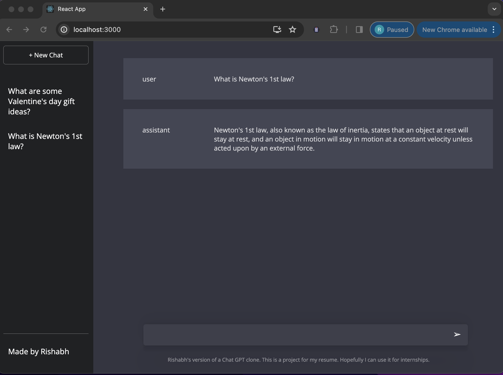

# RishGPT 
A Custom ChatGPT UI


## About this Project
### Built With
- [![Express][Express.js]][Express-url]
- [![React][React.js]][React-url]
- [![OpenAI][OpenAI]][OpenAI-url]
  
### Description/Motivation
RishGPT acts as a clone of OpenAI's ChatGPT but with a custom UI. Currently, the UI is directly replicated from ChatGPT, but the goal is to make it more user friendly and visually aesthetic. Users can also enter customized prompt instructions such as for generating SQL queries or writing cover letters. Additionally, users can store interactions in SQL databases on-prem instead of in the cloud as traditional ChatGPT does.

This project was built for full-stack experience including frontend development with React, HTML, and CSS, and backend development with Express and API calls with OpenAI's Chat Completions API.

### Video demo


## Getting Started
### Prerequisites
* npm
  ```sh
  npm install npm@latest -g
  ```
### Installation
1. Create an Open AI API Key at [https://platform.openai.com/api-keys](https://platform.openai.com/api-keys)
2. Clone the repo
   ```sh
   git clone https://github.com/risharma101/RishGPT/
   ```
3. Install NPM packages
   ```sh
   npm install
   ```
4. Create a `.env` file in the main project folder and enter your API Key in it
   ```js
   const API_KEY = 'ENTER YOUR API';
   ```
## Launching
1. Launch the frontend
   ```sh
   npm run start:frontend
   ```
2. Launch the backend
   ```sh
   npm run start:backend
   ```

[OpenAI]: https://github.com/risharma101/RishGPT/assets/52262619/fb84c1c7-de60-4ce1-a6ae-c29fec342999
[OpenAI-url]: https://platform.openai.com/docs/guides/text-generation
[Express.js]: https://img.shields.io/badge/Express.js-404D59?style=for-the-badge
[Express-url]: https://expressjs.org/
[React.js]: https://img.shields.io/badge/React-20232A?style=for-the-badge&logo=react&logoColor=61DAFB
[React-url]: https://reactjs.org/
