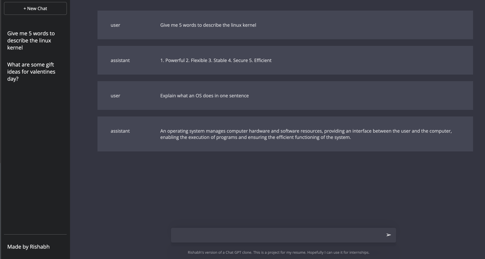

# RishGPT -- A ChatGPT Clone.

#### A fullstack project created using React, Express, and Node, modeling OpenAI's ChatGPT UI. 

## To launch the project:
- Create an OpenAI API key and replace the key with the one in .env
- Open two terminal windows and `cd react-chatgpt-clone` on each
- Run `npm install` on the first one
- Run `npm run start:frontend` on the first 
- Run `npm run start:backend` on the second
  
